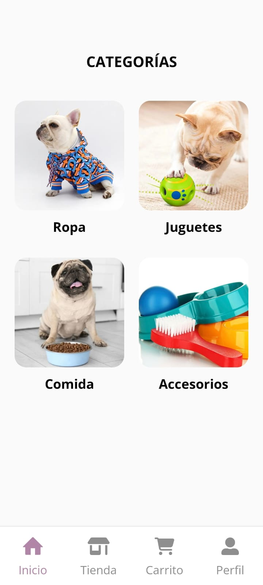
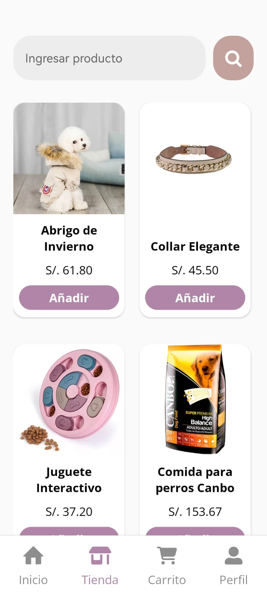
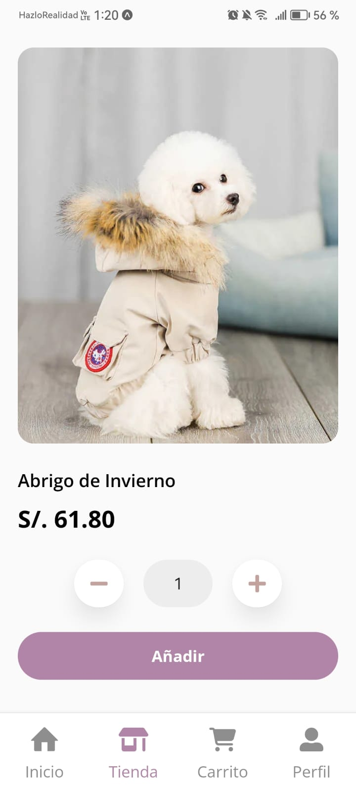
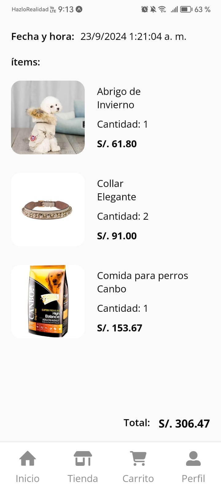

# PetParadise 🐶

PetParadise es una aplicación de comercio electrónico para mascotas desarrollada con React Native. Ofrece una experiencia de compra completa y fácil de usar, permitiendo a los usuarios navegar, buscar y adquirir productos para sus mascotas de manera sencilla.

## Funcionalidades Principales

### Pantalla de Perfil

- **Acceso seguro:** Solo los usuarios autenticados pueden acceder a la pantalla de perfil y realizar compras.
- **Información del usuario:** Muestra detalles del usuario y sus órdenes de compra.

  
  

### Pantalla de Login y SignUp

- **Autenticación segura:** Utiliza el sistema de autenticación de Firebase para gestionar el acceso de usuarios.
- **Registro sencillo:** Permite a los usuarios iniciar sesión y registrarse de manera segura, asegurando que sus datos estén protegidos.

  
  

### Pantalla de Inicio

- **Navegación intuitiva:** Muestra una selección de categorías en tarjetas para facilitar la búsqueda de productos.
- **Acceso directo a productos:** Al hacer clic en una categoría, se navega a la pantalla de productos correspondiente, mejorando la experiencia del usuario.

  

### Pantalla de Productos

- **Variedad de productos:** Lista todos los productos en tarjetas con nombre y foto para una visualización clara.
- **Buscador integrado:** Incluye un buscador para filtrar productos por nombre, ayudando a los usuarios a encontrar rápidamente lo que buscan.
- **Detalles accesibles:** Al hacer clic en un producto, se navega a la pantalla de detalles del producto para obtener más información.

  

### Pantalla de Detalles del Producto

- **Descripción completa:** Proporciona una descripción detallada del producto, asegurando que los usuarios tengan toda la información necesaria.
- **Agregar al carrito:** Permite agregar el producto al carrito de compras de manera sencilla.

  

### Pantalla de Carrito de Compras

- **Resumen del carrito:** Muestra todos los productos agregados al carrito, con la opción de modificar cantidades o eliminar artículos.
- **Finalizar compra:** Incluye un botón para proceder al pago, permitiendo a los usuarios completar su compra de manera rápida y eficiente.

  

### Pantalla de Detalle de Orden de Compra

- **Historial de compras:** Permite a los usuarios ver los detalles de sus órdenes pasadas, incluyendo productos adquiridos y precios.

  

## Tecnologías Utilizadas

- **Firebase Authentication:** Implementa el sistema de autenticación de Firebase para gestionar la seguridad de la aplicación.
- **React Native Navigation Stack:** Gestiona la navegación entre pantallas.
- **React Native Navigation Bottom Tab:** Gestiona la navegación entre pestañas.
- **Expo-Image-Picker:** Facilita la carga de imágenes de perfil.
- **Redux:** Centraliza y gestiona el estado de la aplicación.
- **RTK Query y Firebase:** Realiza operaciones de lectura/escritura en la base de datos.
